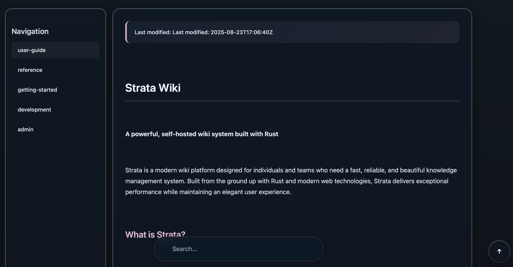

# Strata

Self-hosted personal wiki for your home lab, built with Rust and Axum. Strata turns Markdown files into a fast, elegant knowledge base with clean navigation, search, and a modern UI.

<p align="center">
  
</p>

## Table of Contents

- [Features](#features)
- [Getting Started](#getting-started)
- [Configuration](#configuration)
- [Usage](#usage)
- [Content Structure](#content-structure)
- [Documentation](#documentation)
- [Development](#development)
- [License](#license)

## Features (currently supported)

- Markdown-first content with heading anchors and table of contents
- Clean, responsive UI
- Sidebar navigation generated from your directory structure
- Fast rendering and low resource usage (Rust)
- Search across titles and content
- Raw view to inspect source Markdown
- No client-side JavaScript required for core features

## Getting Started

1. Clone and build:
```bash
git clone https://github.com/your-org/strata.git
cd strata
cargo build --release
```

2. Run:
```bash
./target/release/strata
```

3. Open (defaults):
```
http://127.0.0.1:5004
```

Content lives under the `wiki/` directory. Add `.md` files and folders to organize your wiki. Use `index.md` in a folder as its landing page.

## Usage

- Navigate using the left sidebar; sections expand to reveal inner pages.
- The page table of contents appears when multiple headings exist.
- Use the search in the bottom floating bar to locate content by text.
- Click “Raw” to view source Markdown for the current page.

## Content Structure

Recommended layout:

```
wiki/
├── index.md                  # Homepage
├── getting-started/
│   ├── index.md
│   ├── installation.md
│   ├── quick-start.md
│   └── configuration.md
├── user-guide/
│   ├── index.md
│   ├── writing-content.md
│   └── markdown-syntax.md
├── admin/
│   ├── index.md
│   ├── file-organization.md
│   └── performance.md
└── development/
    ├── index.md
    ├── architecture.md
    └── deployment.md
```

## Configuration

Defaults (current build):

- Content directory: `./wiki`
- Static assets: `./static`
- Host: `0.0.0.0`
- Port: `5004`

Runtime configuration via CLI flags, config files, or env vars is not exposed in this build.

## Documentation

- Getting Started: `wiki/getting-started/`
- User Guide: `wiki/user-guide/`
- Administration: `wiki/admin/`
- Development: `wiki/development/`

Open the app locally and browse via the sidebar, or view files directly under `wiki/` in your editor.

## Development

```bash
cargo run
```

- Code in `src/`
- Static assets in `static/`
- Content in `wiki/`

## License

MIT
